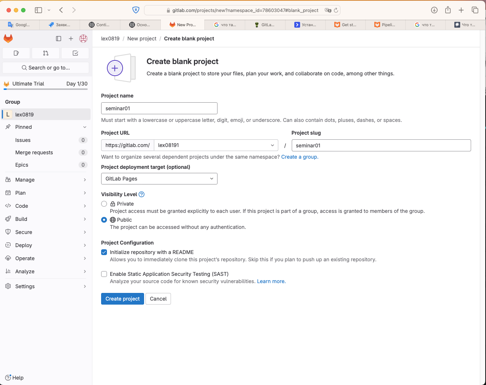
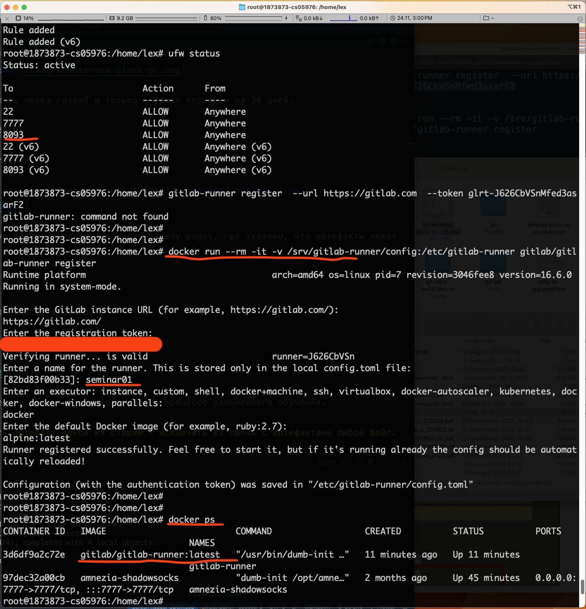
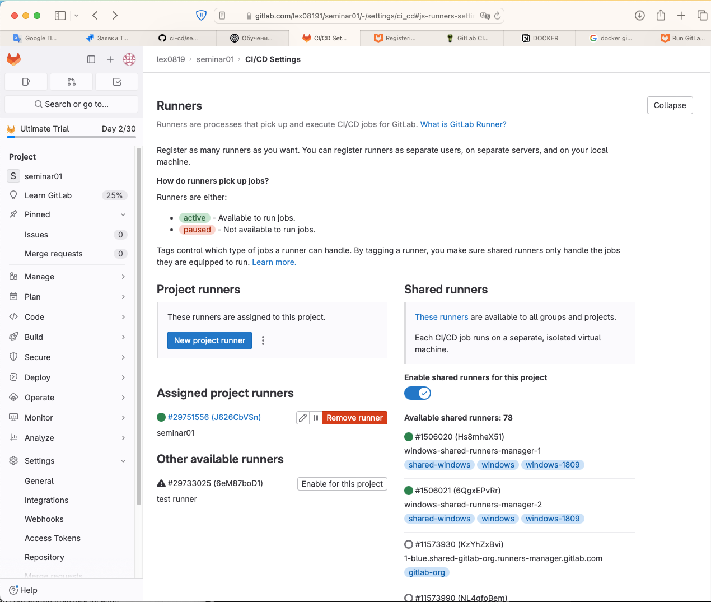
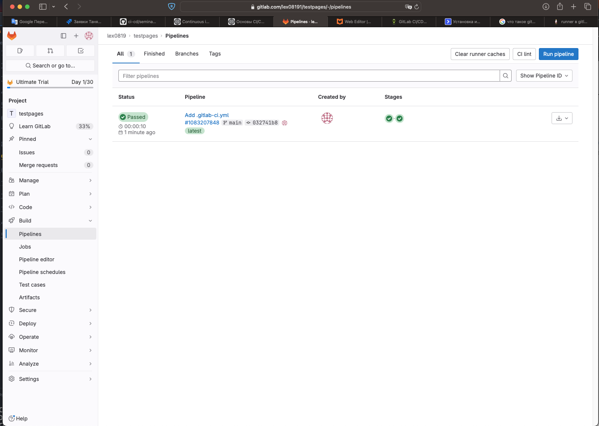
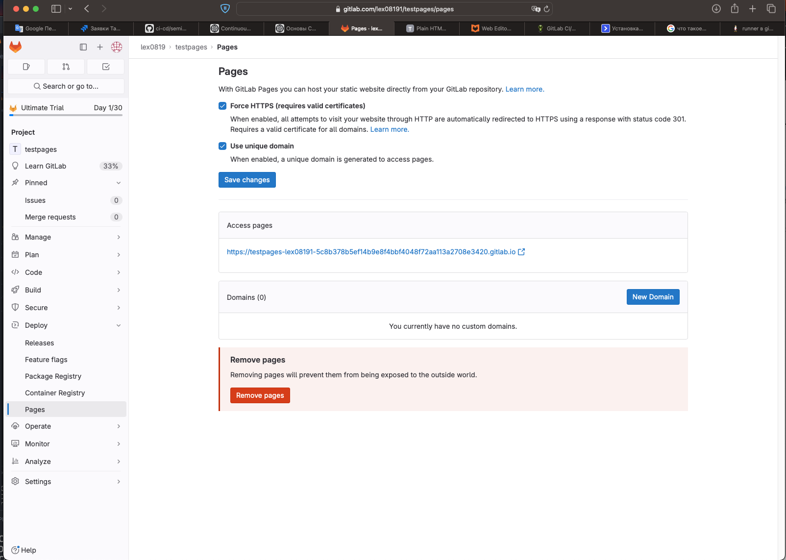

# ДЗ семинар 1

## Зарегистрироваться на gitlab.com

Зарегистрировалась на сервисе.



Аккаунт получилось сделать через гитхаб и только с триал периодом на 30 дней.

https://gitlab.com/lex08191

## Создать pipeline и runner.

См. простейший пайплан для простейшего сайта в файле [/testpages/.gitlab-ci.yml](./testpages/.gitlab-ci.yml)

Пайплайн ничего особо не делает, просто выполняет задачу pages, где указано, что артефакты лежат в папке public.

### runner

Поставила раннер на свой сервер в докер.



Project -> Settings - > CI/CD -> Runners -> New runner

Раннер доступен в моем гитлабе



## Попробовать сохранить артефакт одной из стадий + исключить из папки с артефактами любой файл.

[.gitlab-ci.yml](./.gitlab-ci.yml)

example

```bash
build-pr:
  stage: build
  script:
    - mkdir -p binaries
    - cd binaries
    - echo test1 >> file1.txt
    - echo test2 >> file2.txt
    - mkdir -p temp
    - cd temp
    - echo test1 >> temp1.txt
    - echo test2 >> temp2.txt
  artifacts:
    paths:
      - binaries/
    exclude:
      - binaries/temp/**/*
```

## Попробовать сделать любую gitlab pages.

Сделала тестовый проект



https://gitlab.com/lex08191/testpages

код проекта см. в папке [testpages/](./testpages/)

Сайт проекта доступен по адресу



https://testpages-lex08191-5c8b378b5ef14b9e8f4bbf4048f72aa113a2708e3420.gitlab.io/

Пример джоба в пайплайне для гитлаб пейджес:

```bash
pages:
  stage: deploy
  script:
    - mkdir -p public
    - cp house.txt public/index.html
  artifacts:
    paths:
      - public
    only:
      - main
```
