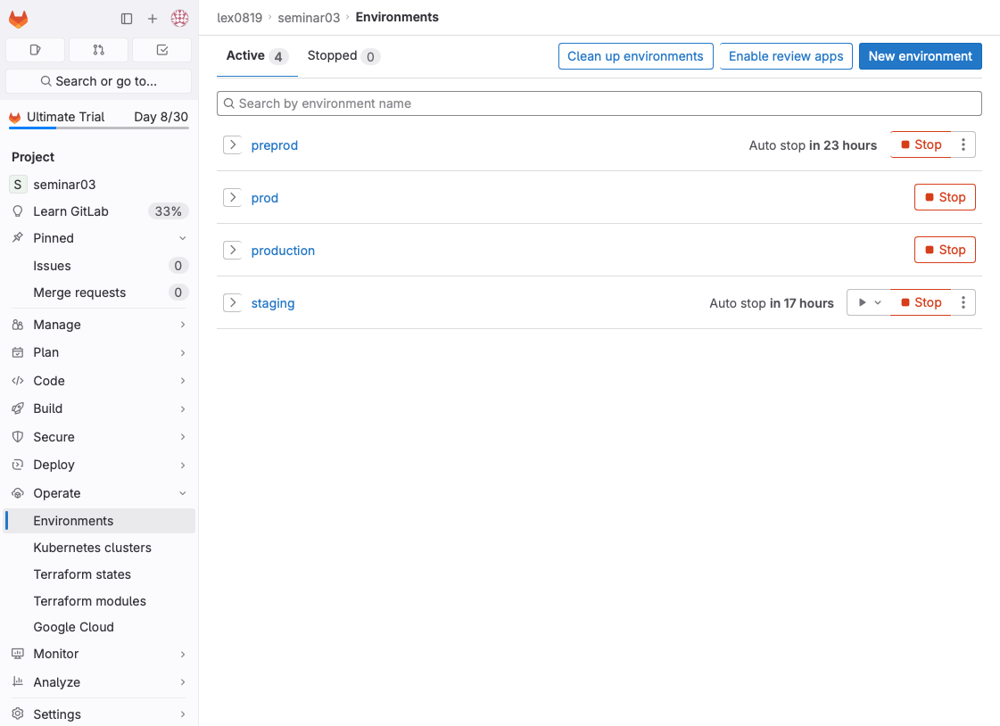
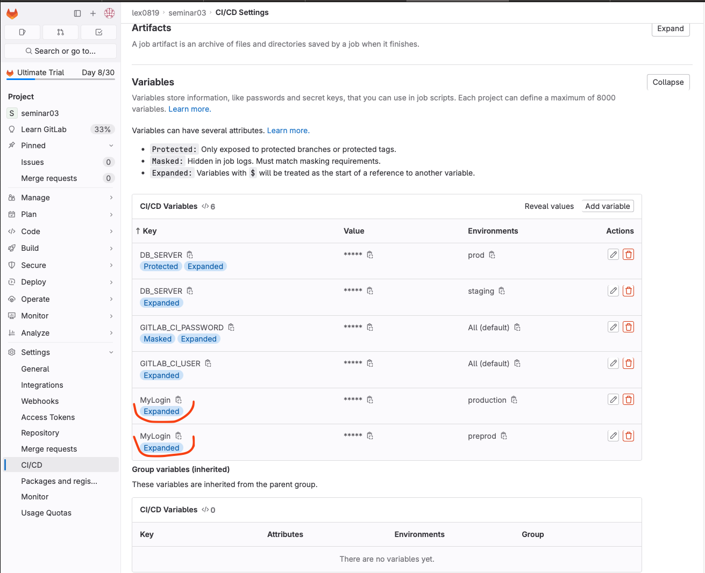
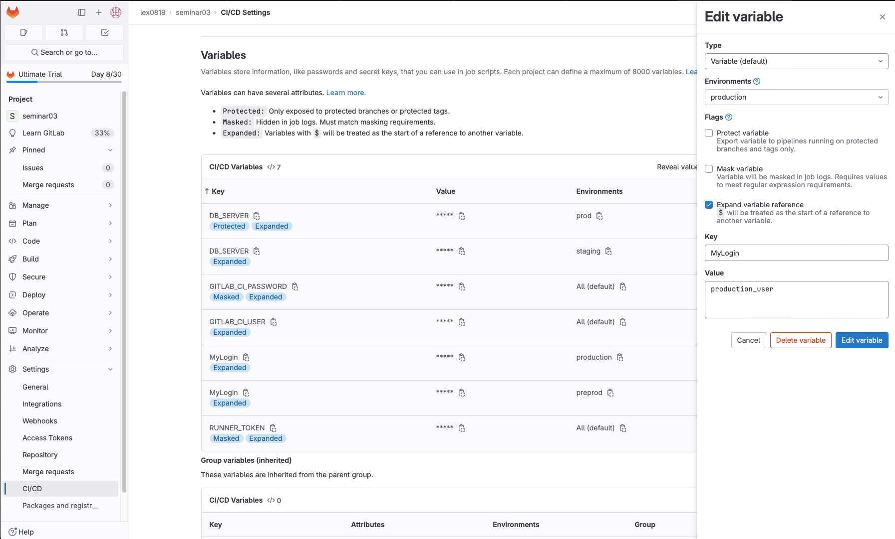
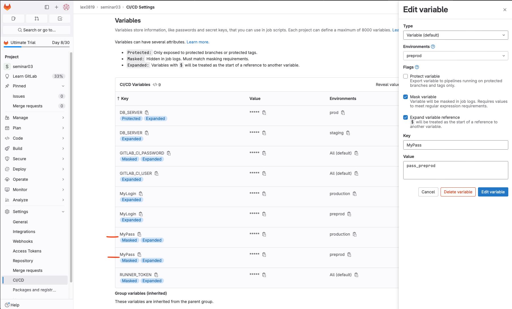

# Урок 3. Continuous delivery и continuous deployment (непрерывная доставка и развертывание)

## .gitlab-ci.yml

Итоговый pipeline см в файле [.gitlab-ci.yml](./.gitlab-ci.yml)

1. Добавить 2 окружения "preprod" и "production"
   

2. Добавить отдельные deploy job для каждой среды

```yml
deploy to preprod:
  stage: deploy
  variables:
    TARGET_ENV: preprod
  script:
    - echo "Do you deploy here to ${TARGET_ENV}"
    - echo ${MyLogin}
  only:
    - main
  environment:
    name: preprod
    auto_stop_in: 1 day
```

```yml
deploy to production:
  stage: deploy
  variables:
    TARGET_ENV: production
  script:
    - echo "Do you deploy here to ${TARGET_ENV}"
    - echo ${MyLogin}
  only:
    - main
  when: manual
  environment:
    name: production
```

3. Добавить переменную "$MyLogin" внутри .gitlab-ci.yml, которая будет меняться в зависимости от среды.
   



4. Добавить переменную "$MyPassword" не используя .gitlab-ci.yml, которая так же будет меняться в зависимости от среды.



5. (\*) Добавить скрипт в .gitlab-ci.yml, который найдёт все запущенные pipeline по названию ветки(ref) и остановит их.

Создать в User Settings -> Access Tokens
Personal Access Token

Создать в Settings -> CI/CD -> Variables
New variable
Key = RUNNER_TOKEN
Value = Personal Access Token

Добавить stage
stop previous jobs
в stages:

```yml
stages:
  - build
  - test
  - deploy
  - stop
  - stop previous jobs # найдёт все запущенные pipeline по названии ветки(ref) и остановит их
```

Добавить job cancel в pipeline

```yml
cancel:
  stage: stop previous jobs
  image: everpeace/curl-jq
  script:
    - |
      if [ "$CI_COMMIT_REF_NAME" == "main" ]
        then
          (
            echo "Cancel old pipelines from the same branch except last"
            OLD_PIPELINES=$( curl -s -H "PRIVATE-TOKEN: $RUNNER_TOKEN" "https://gitlab.com/api/v4/projects/${CI_PROJECT_ID}/pipelines?ref=${CI_COMMIT_REF_NAME}&status=running" \
                  | jq '.[] | .id' | tail -n +2 )
                  for pipeline in ${OLD_PIPELINES}; \
                      do echo "Killing ${pipeline}" && \
                        curl -s --request POST -H "PRIVATE-TOKEN: ${RUNNER_TOKEN}" "https://gitlab.com/api/v4/projects/${CI_PROJECT_ID}/pipelines/${pipeline}/cancel"; done
          ) || echo "Canceling old pipelines (${OLD_PIPELINES}) failed"
      fi
```
