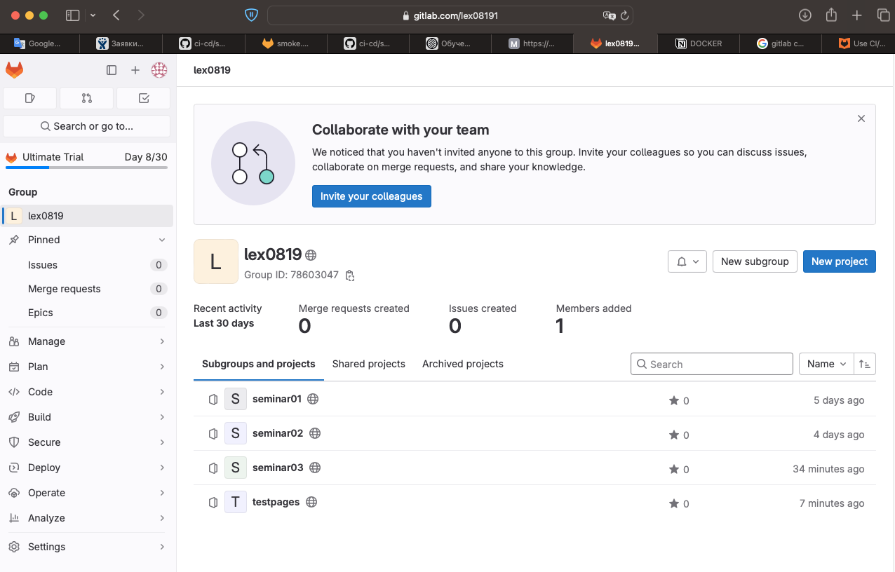
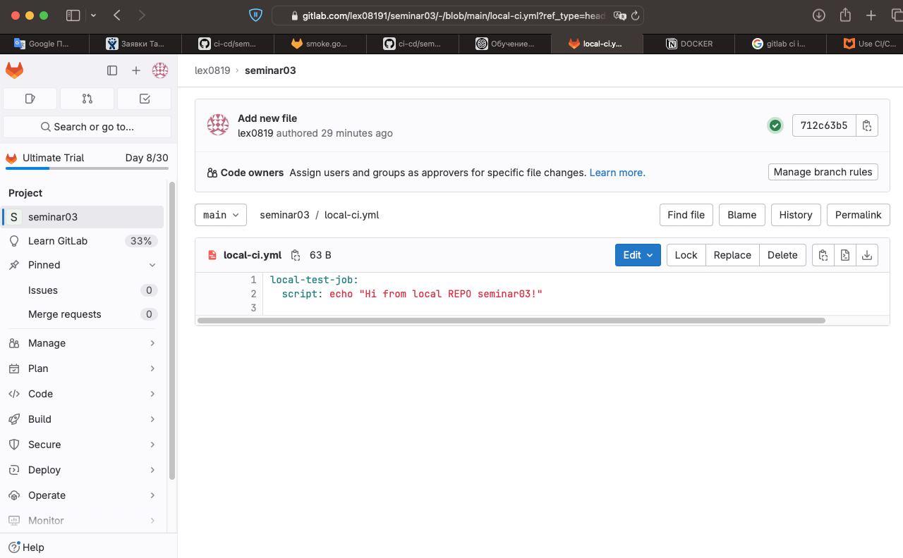
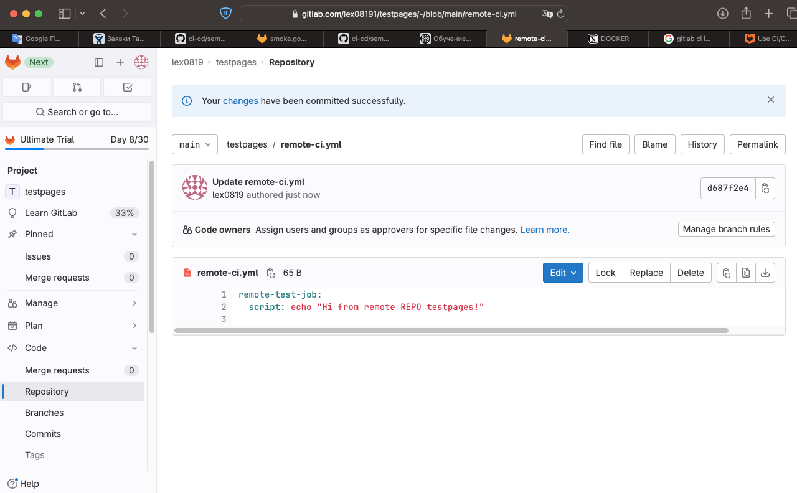
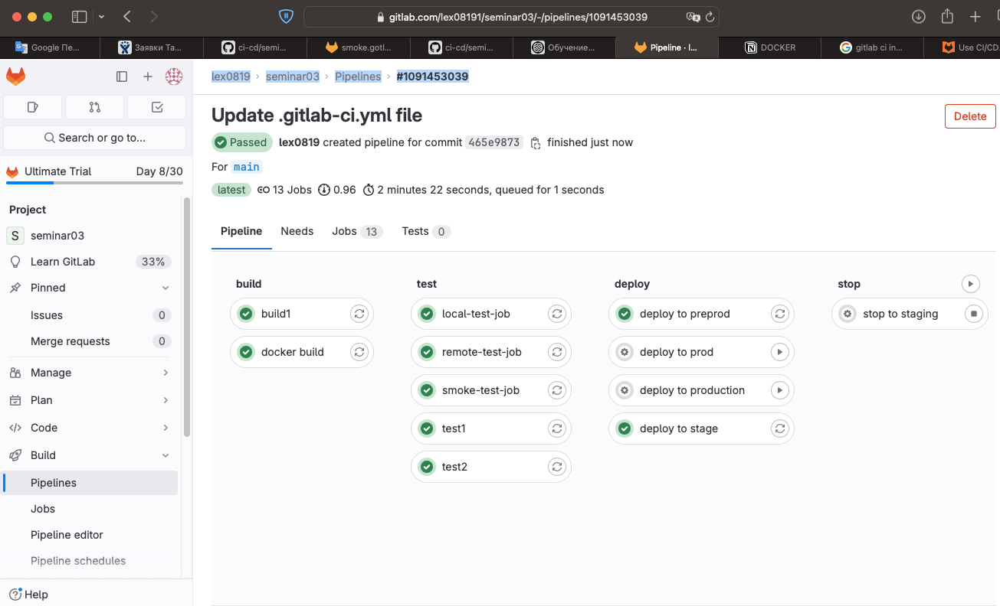
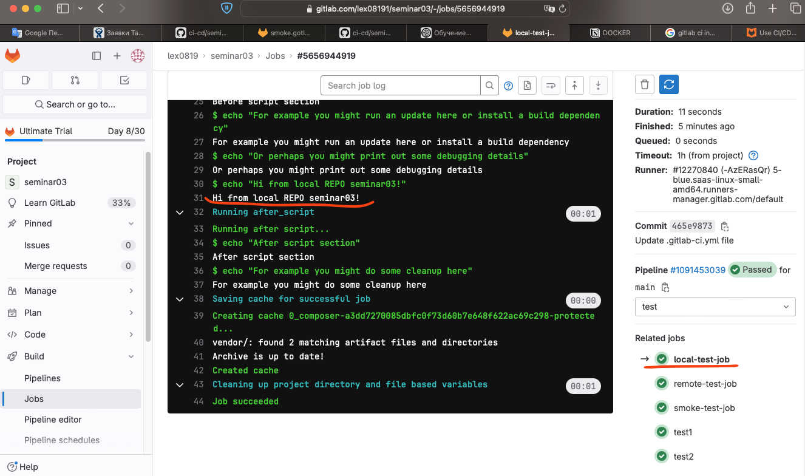
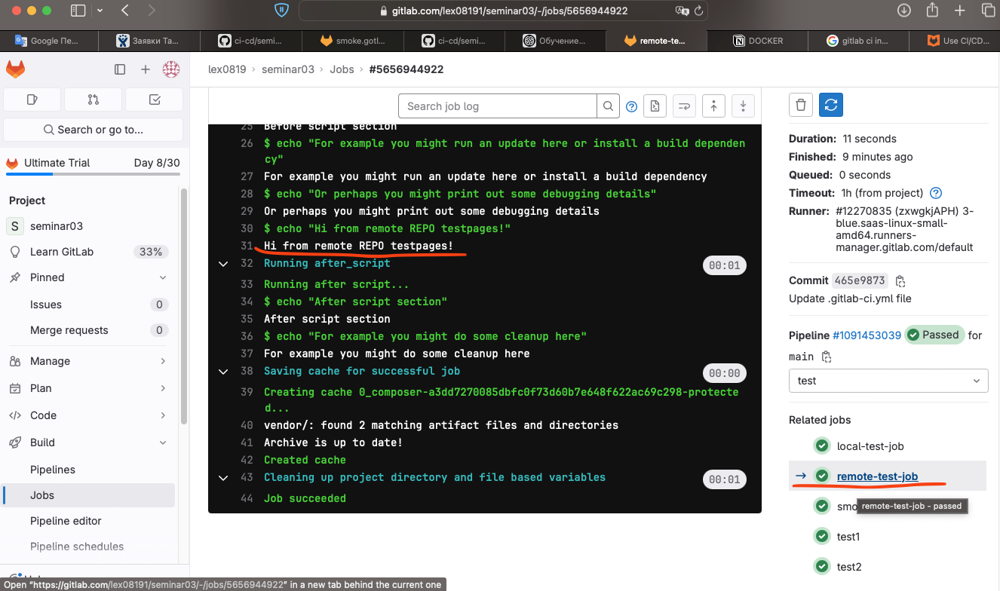

# Урок 4. Troubleshooting (диагностика и решение проблем в CI/CD)

## Задание

Сделать локальный шаблон CI и отдельный репозиторий с шаблонами, подключить их к своему основному репозиторию через include.

## Решение

Я сделала несколько репозиториев на гитлабе.



В репозитории проекта **seminar03** создан файл [local-ci.yml](./local-ci.yml)


Ссылка на проект **seminar03**

https://gitlab.com/lex08191/seminar03

В репозитории другого проекта **testpages** создан файл [remote-ci.yml](./remote-ci.yml)


Это путь к файлу из репозитория **testpages**
https://gitlab.com/lex08191/testpages/raw/main/remote-ci.yml

Pipeline seminar03 содержит вызов этих двух репозиториев.

```yml
include:
  - local: 'local-ci.yml'
  - remote: 'https://gitlab.com/lex08191/testpages/raw/main/remote-ci.yml'
```

Ссылка на pipeline seminar03 [.gitlab-ci.yml](./.gitlab-ci.yml)

Pipeline отработал хорошо.
Все инклуды подключились и выполнились.

[lex0819 -> seminar03 -> Pipelines -> #1091453039](https://gitlab.com/lex08191/seminar03/-/pipelines/1091453039)



include local


include remote


## Docs

https://docs.gitlab.com/ee/ci/yaml/includes.html

```yml
include:
  - remote: 'https://gitlab.com/awesome-project/raw/main/.before-script-template.yml'
  - local: '/templates/.after-script-template.yml'
```
